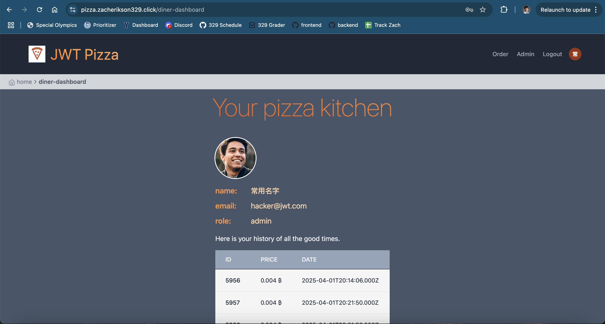
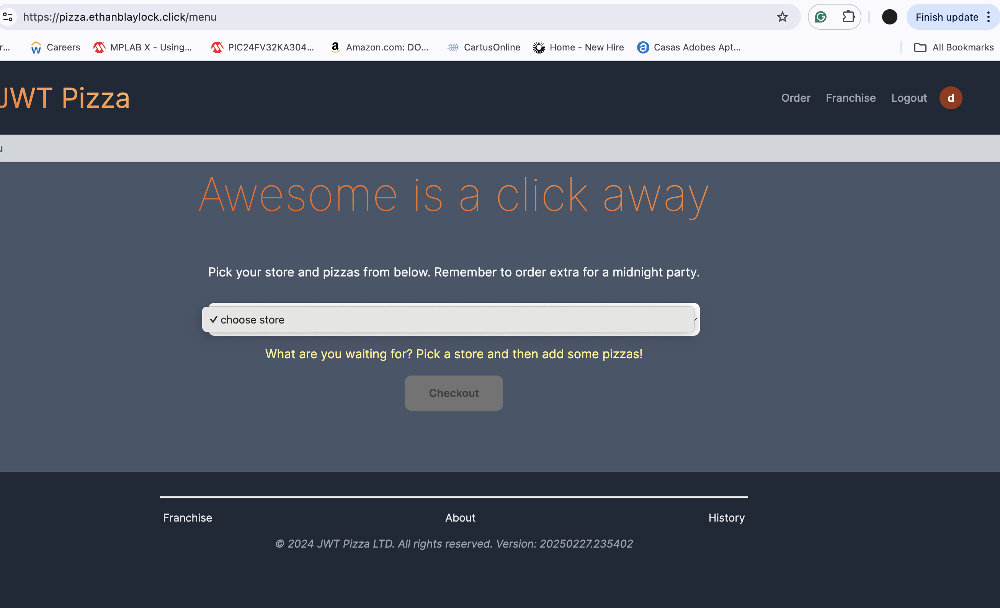
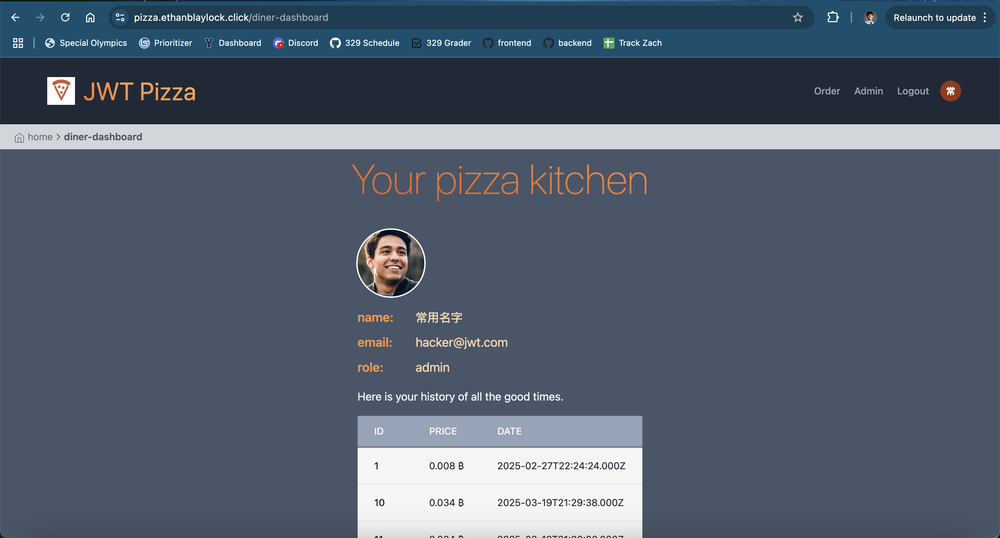
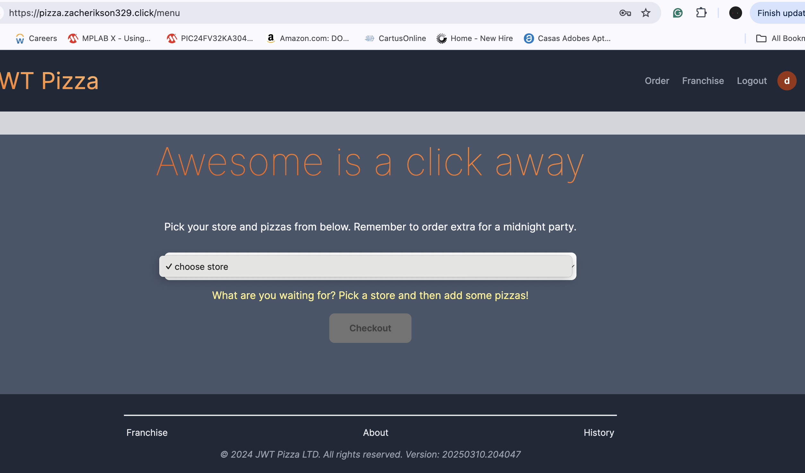

# Report

## Names

- Zach Erikson
- Ethan Baylock

## Self Attack

### Zach Erikson Self Attack

| Item           | Details                                                                                                                                 |
| -------------- | --------------------------------------------------------------------------------------------------------------------------------------- |
| Result         | SQL Injection                                                                                                                           |
| Date           | April 10, 2025                                                                                                                          |
| Target         | pizza.zacherikson329.click                                                                                                              |
| Classification | Injection                                                                                                                               |
| Severity       | 1                                                                                                                                       |
| Description    | SQL injection. Rewrote all user data to be email=hacker@jwt.com and password=p. Now hacker@jwt.com is admin and no one else has access. |
| Images         |                                                                                                  |
| Corrections    | Sanitize user inputs in updateUser function                                                                                             |

### Ethan Blaylock Self Attack

| Item           | Details                                                                                                                                 |
| -------------- | --------------------------------------------------------------------------------------------------------------------------------------- |
| Date           | April 11, 2025                                                                                                                          |
| Target         | pizza.ethanblaylock.click                                                                                                              |
| Classification | 	Insecure Design                                                                                                                               |
| Severity       | 1                                                                                                                                       |
| Description    | DoS attack. Made a diner account and made a large number of HTTP requests, ordering thousands of pizzas in one order. This rendered the backend unusable, making the website unable to make backend requests |
| Images         |                                                                                                  |
| Corrections    | Limit requests from users                                                                                            |

## Peer Attack

### Zach Erikson Attack on Ethan Baylock

| Item           | Details                                                                                                                                 |
| -------------- | --------------------------------------------------------------------------------------------------------------------------------------- |
| Result         | SQL Injection                                                                                                                           |
| Date           | April 10, 2025                                                                                                                          |
| Target         | pizza.ethanblaylock.click                                                                                                               |
| Classification | Injection                                                                                                                               |
| Severity       | 1                                                                                                                                       |
| Description    | SQL injection. Rewrote all user data to be email=hacker@jwt.com and password=p. Now hacker@jwt.com is admin and no one else has access. |
| Images         |                                                                                          |
| Corecctions    | Sanitize user inputs in updateUser function                                                                                             |

### Ethan Blaylock Attack on Zach Erikson

| Item           | Details                                                                                                                                 |
| -------------- | --------------------------------------------------------------------------------------------------------------------------------------- |
| Date           | April 11, 2025                                                                                                                          |
| Target         | pizza.zacherikson329.click                                                                                                              |
| Classification | 	Insecure Design                                                                                                                               |
| Severity       | 1                                                                                                                                       |
| Description    | DoS attack. Made a diner account and made a large number of HTTP requests, ordering thousands of pizzas in one order. This rendered the backend unusable, making the website unable to make backend requests |
| Images         |                                                                                                  |
| Corrections    | Limit requests from users                                                                                            |

## Learnings

One thing we learned about was the importance of sanitizing user inputs. SQL Injections are dangerous but they can be prevented by using proper protocols. There are already some safety nets built in to the js library mysql2 to prevent SQL attacks, but it's still possible. For example, you cannot have multiple queries in a single line. Doing "UPDATE user.....; DROP TABLE user; -- " would not work. However, you could ignore trying to drop a table and just alter the user data. If you properly sanitize user inputs, then this is completely avoided.

Another thing we learned about was the importance of limiting user requests. Denial-of-Service attacks can render good websites unusable if not guarded against. If an attacker is able to repeatedly hit a vulnerable endpoint—especially one that performs expensive operations or communicates with third-party services—it can quickly overwhelm the server or incur unnecessary costs. Adding rate limiting, input validation, and payload size restrictions are effective ways to mitigate this kind of abuse. Even seemingly harmless endpoints, like order creation, can be exploited without proper safeguards.